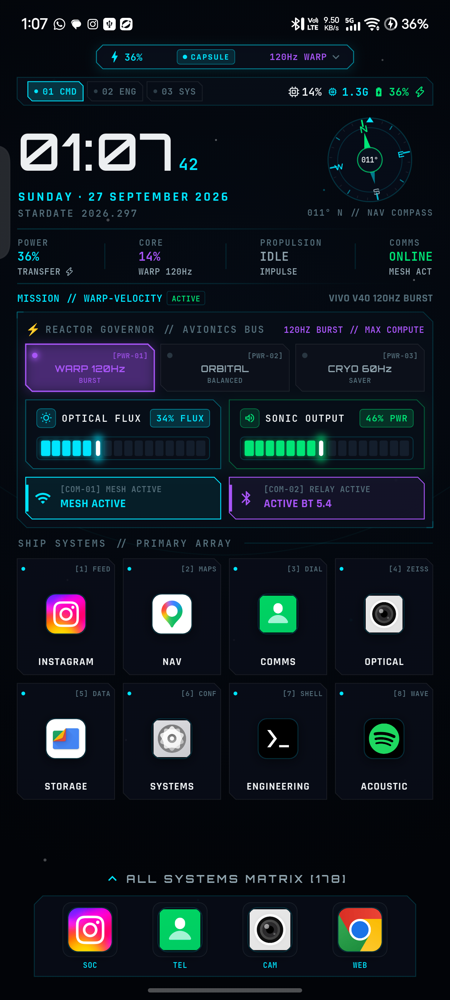
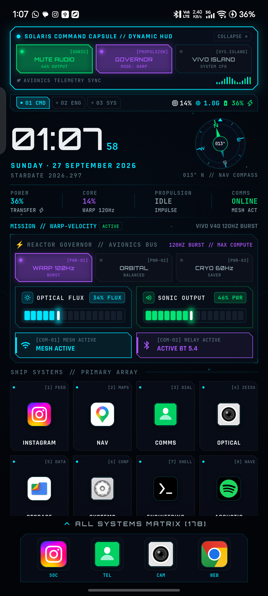
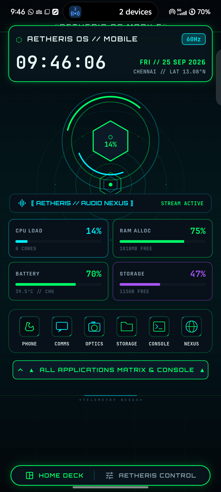

# 🚀 Lunaris OS (Mobile Edition)

> **Aerospace Spacecraft Cockpit Launcher & Telemetry System for Android**  
> *Designed as the mobile companion to [Solaris OS](https://github.com/venkatengineer/solaris-os).*

[](https://flutter.dev)
[](https://android.com)
[](https://kotlinlang.org)
[](LICENSE)

---

## 🛰️ Visual Showcase

| Spacecraft Bridge HUD | Themed Dynamic Capsule | Application Matrix |
| :---: | :---: | :---: |
|  |  |  |

---

## 🌟 What is Lunaris OS?

**Lunaris OS** is a complete, futuristic spacecraft cockpit interface built from the ground up to transform standard Android smartphones into high-performance aerospace telemetry bridges. 

Originally created and calibrated for the **Vivo V40 5G** (Snapdragon 7 Gen 3, 120Hz 1.5K AMOLED, punch-hole display), Lunaris OS eliminates generic rounded-corner mobile design language and replaces it with **chamfered titanium hull geometry, real-time hardware sensor instrumentation, tactile cockpit buttons, an in-house Dynamic Island command capsule, and an ultra-smooth clip-reveal app transition pipeline.**

---

## ⚡ Core Features & Systems Breakdown

```mermaid
graph TD
    A[Lunaris OS Root] --> B[Top Bridge HUD]
    A --> C[Avionics & Reactor Governor]
    A --> D[Ship Systems Array & Dock]
    A --> E[Engineering Deck]
    A --> F[Application Matrix]

    B --> B1[Themed Dynamic Capsule]
    B --> B2[Hardware Gyrocompass HUD]
    B --> B3[Waybar Workspace Nodes]
    B --> B4[4 Flight Pillars]

    C --> C1[WARP / ORBITAL / CRYO Switches]
    C --> C2[Quiet Sonic Output Slider]
    C --> C3[Optical Flux Brightness Slider]
    C --> C4[Subspace Mesh & Quantum Relay]

    D --> D1[Tactile Module Bays SYS.01-08]
    D --> D2[Integrated Launch Dock]

    E --> E1[Propulsion & Core Diagnostics]
    E --> E2[BlueVolt Life Support Telemetry]
    E --> E3[IMU & Magnetometer Array]

    F --> F1[Universal Swipe-Up Gesture]
    F --> F2[Vertical Center Alphabet Rail]
    F --> F3[Telemetry Horizon Sweep]
```



### 1. 🪐 Solaris Command Capsule (Themed Dynamic Island)
* **Punch-Hole Integration**: Hugs the physical camera punch-hole cutout at the top of the screen with glowing cyan telemetry borders.
* **Collapsed Mode**: Displays live charging wattage/battery percentage, an oscillating multi-bar audio equalizer (` ▂▃▅`), and live performance modes (`120Hz WARP`, `VOL %`, `COMPASS`).
* **Tactical Command HUD**: Tap anywhere to smoothly unroll (280ms easeOutCubic) into an expanded command deck:
  * **Sonic Mute Toggle**: Instant hardware sound muting and percentage output.
  * **Reactor Governor Switch**: Cycle between `WARP`, `ORBITAL`, and `CRYO` modes.
  * **Vivo Island & Notification Bridge**: One-tap shortcut directly into Android and Vivo status bar / dynamic island settings.
  * **Dynamic Equalizer Spectrum**: 14-channel reactive audio spectrum visualizer.

### 2. 🧭 Real-Time Hardware Gyrocompass (`SolarisNavViewportWidget`)
* **Magnetic North Tracking**: Connects to the device's hardware magnetometer and accelerometer via an Android `Sensor.TYPE_ROTATION_VECTOR` EventChannel.
* **Flight Rose & Index**: Real-time rotating compass dial with cardinal markers (`N, E, S, W`), glowing emerald north indicator, forward flight index, and digital heading readout (e.g. `142° SE // NAV COMPASS`).
* **Shortest Angular Distance Smoothing**: Seamless heading interpolation across the 360°/0° boundary without jitter.

### 3. 🛸 Chamfered Hull Geometry & Tactile Cockpit Buttons
* **`SolarisHullPanel`**: High-tech container featuring 45° beveled aerospace cuts, glowing neon borders, unchamfered corner brackets, corner hex rivets, and illuminated conduit status lines.
* **`SolarisCockpitButton`**: Heavy-duty hardware rocker switches with active LED status diodes:
  * **WARP Mode** (120Hz Burst): Glowing Magenta diode `[PWR-01]`.
  * **ORBITAL Mode** (120Hz Adaptive): Glowing Cyan diode `[PWR-02]`.
  * **CRYO Mode** (60Hz Conserve): Glowing Emerald diode `[PWR-03]`.

### 4. 🎚️ Quiet Tactical Sliders (Flux & Sonic)
* **Optical Flux**: Smooth segmented slider controlling Android system screen luminance.
* **Sonic Output**: Segmented audio volume scrubber with synthesized sci-fi click audio ticks on every 6% increment.
* **Zero Intrusive Popups**: Suppressed Android's default `AudioManager.FLAG_SHOW_UI` (`flag: 0`), ensuring native system volume overlays never block your screen.

### 5. 🚀 Ultra-Smooth App Launch & Recents Overview
* **Instant Clip-Reveal Animation**: Native `ActivityOptions.makeClipRevealAnimation` expanding directly from the tapped icon coordinates without black flashes or artificial pauses.
* **Android Recents Architecture**:
  * Configured with `launchMode="singleTask"` and `clearTaskOnLaunch="true"`.
  * Removed empty `taskAffinity=""` so Android's Quickstep/SystemUI Recents overview seamlessly creates live snapshots and enables instantaneous swipe-switching between running tasks.

### 6. 📱 Primary Ship Systems Array & Flight Dock
* **Aerospace Module Plates**: All primary apps (`INSTAGRAM`, `NAV`, `COMMS`, `OPTICAL`, `STORAGE`, `SYSTEMS`, `ENGINEERING`, `ACOUSTIC`) are housed inside individual beveled flight plates with module serials (`[SYS.01]` to `[SYS.08]`) and status LED conduits.
* **Integrated Dock**: Bottom rack with illuminated launch bays for core daily drivers (`SOC`, `TEL`, `CAM`, `WEB`).

### 7. 🗂️ Universal Swipe-Up Application Matrix
* **Universal Gesture**: Swipe up anywhere on the home screen (empty spaces, background, clock, dock) to instantly reveal the full app matrix.
* **Center-Aligned Alphabet Rail**: Selecting letters like `I`, `S`, or `M` automatically centers matching apps dead-center in the viewport rather than pushing them to the bottom edge.
* **Telemetry Horizon Line**: Replaced aggressive neon scanlines with an ultra-delicate 1px holographic horizon sweep.

---

## 📦 Repository Structure

```
lunaris-os/
├── aetheris_control/               # Core Flutter Android launcher application
│   ├── android/                    # Native Android platform code
│   │   ├── app/src/main/
│   │   │   ├── AndroidManifest.xml # Launcher intent-filters, singleTask mode, taskAffinity
│   │   │   └── kotlin/.../
│   │   │       ├── MainActivity.kt # MethodChannel & EventChannel hardware sensor bridge
│   │   │       └── SciFiAudioEngine.kt # Synthesized audio engine
│   │   └── build.gradle.kts
│   ├── assets/                     # Packaged launcher assets (fonts, icons, wallpapers)
│   ├── lib/
│   │   └── main.dart               # Complete launcher UI, bridge HUD, dynamic capsule
│   └── pubspec.yaml                # Flutter project configuration
├── assets/                         # Master asset library
│   ├── fonts/                      # Orbitron, JetBrains Mono, Rajdhani
│   ├── icons/                      # Custom sci-fi vector glyphs
│   └── wallpapers/                 # Spacecraft cockpit & AOD graphics
├── screenshots/                    # High-resolution screenshots of the UI
├── scripts/                        # Python asset generator tools
│   ├── generate_aetheris_assets.py
│   ├── generate_clean_icons.py
│   └── generate_crisp_glyphs.py
├── install.sh                      # 1-Click build & deploy script
├── .gitignore                      # Git exclusion rules
└── README.md                       # Complete documentation
```

---

## 🛠️ Step-by-Step Installation Guide

Follow these instructions to build and install Lunaris OS onto your Android device.

### 1. Prerequisites

Ensure your host machine has the following tools installed:
* **Flutter SDK** (>= 3.24.0) — [flutter.dev](https://docs.flutter.dev/get-started/install)
* **Android SDK & Platform Tools** (API 34+) — includes `adb`
* **Java JDK** (version 17 or higher)
* **Git**

Verify with:
```bash
flutter doctor
adb version
```

---

### 2. Prepare Your Phone (USB Debugging)

1. Open **Settings** on your phone.
2. Navigate to **About Phone** (or **System Management**).
3. Tap **Build Number** 7 times until you see `"You are now a developer!"`.
4. Return to **Settings -> System -> Developer Options**.
5. Enable:
   * **USB Debugging**
   * **Install via USB** (on Vivo/Xiaomi/Oppo devices)
6. Connect your phone to your computer via USB.
7. Accept the **"Allow USB Debugging?"** popup prompt on your phone (check "Always allow from this computer").
8. Verify connection:
   ```bash
   adb devices
   # Expected output:
   # List of devices attached
   # 10BECB0R9D006EA    device
   ```

---

### 3. Option A: Automated 1-Command Install (Recommended)

Run the included automated installer script from the root of the repository:

```bash
git clone https://github.com/venkatengineer/lunaris-os.git
cd lunaris-os
chmod +x install.sh
./install.sh
```

The script will automatically:
1. Verify `flutter` and `adb`.
2. Detect your connected phone.
3. Fetch Flutter dependencies (`pub get`).
4. Compile the debug APK.
5. Stream-install the APK over ADB with test and downgrade flags.
6. Launch Lunaris OS directly on your device.

---

### 4. Option B: Manual Installation

If you prefer to run the commands manually:

```bash
# 1. Clone repository
git clone https://github.com/venkatengineer/lunaris-os.git
cd lunaris-os/aetheris_control

# 2. Fetch packages
flutter pub get

# 3. Build APK
flutter build apk --debug

# 4. Install onto your connected device
adb install -r -d -t build/app/outputs/flutter-apk/app-debug.apk

# 5. Launch the launcher activity
adb shell am start -n com.aetheris.aetheris_control/.MainActivity
```

---

### 5. Set Lunaris OS as Your Default Launcher

To make Lunaris OS your permanent home screen:

1. On your phone, go to **Settings -> Apps -> Default Apps -> Home app**.
2. Select **Lunaris OS** (listed as *Aetheris Control*).
3. Press your device's home button or swipe up to the home gesture — you are now on the Spaceship Bridge!

---

### 6. Recommended Permissions & Calibration

* **Display Brightness Control**:
  * Tap the `OPTICAL FLUX` header to jump to Android settings and allow the app to **Modify System Settings**.
* **Hardware Compass Calibration**:
  * If the compass heading needs alignment, move your phone in a gentle figure-8 motion for 3 seconds. The native rotation vector sensor will lock onto magnetic north.
* **Vivo Smart Island & Status Bar**:
  * Tap the `VIVO ISLAND [SYS.ISLAND]` button inside the expanded Dynamic Capsule to open your phone's notification and island settings.

---

## 🎨 Asset Generation Scripts

If you want to generate custom icon shapes or wallpapers for your own apps, use the included Python scripts in `scripts/`:

```bash
cd scripts
python3 generate_crisp_glyphs.py  # Generates high-res sci-fi vector glyphs
python3 generate_clean_icons.py   # Renders crisp app drawer icons
python3 generate_aetheris_assets.py # Builds wallpapers and telemetry rings
```

---

## 🤝 Pairing with Solaris OS (Linux)

Lunaris OS is the mobile counterpart to **Solaris OS**, a futuristic sci-fi Linux rice featuring:
* Niri dynamic tiling Wayland compositor
* Waybar aerospace status HUD with workspace nodes
* Custom telemetry background daemon (`solaris-bg`)

Check out the Linux rice repository:  
👉 **[venkatengineer/solaris-os](https://github.com/venkatengineer/solaris-os)**

---

## 📜 License

This project is licensed under the **MIT License**. Feel free to customize, modify, and build your own futuristic mobile interfaces!
